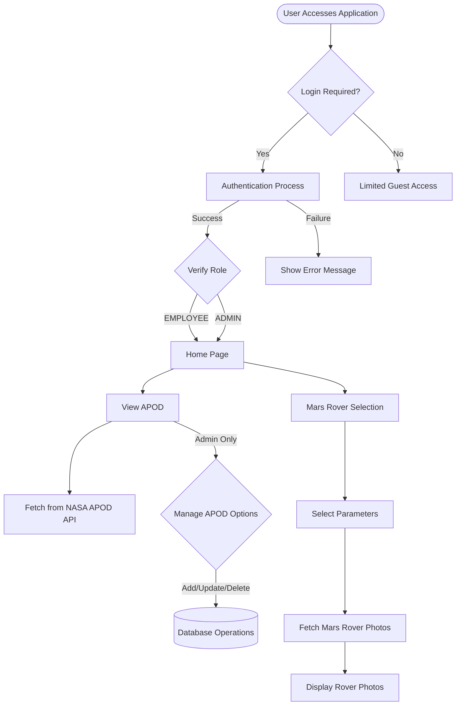

# NASA API Implementation


## 📌 Project Overview

Welcome to the NASA API Implementation project! This full-stack web application utilizes NASA's public APIs to provide users with captivating Astronomy Picture Of The Day (APOD) and Mars Rover Photos. Developed as part of  development internship program, this project demonstrates the integration of various modern technologies to create a robust, secure, and user-friendly application.

Discover breathtaking astronomical imagery and fascinating Mars exploration photos through an intuitive interface, complete with administrative features for data management and a comprehensive API for developers.

## ✨ Features

### 🌠 Astronomy Picture Of The Day (APOD)
- View the current APOD with detailed explanations
- Browse previously saved APODs
- Admin functionality to manage APOD entries (CRUD operations)

### 🔭 Mars Rover Photos
- Select from three different Mars rovers:
  - Curiosity
  - Opportunity
  - Spirit
- Choose from multiple cameras on each rover:
  - FHAZ (Front Hazard Avoidance Camera)
  - RHAZ (Rear Hazard Avoidance Camera)
  - MAST (Mast Camera)
  - CHEMCAM (Chemistry and Camera Complex)
  - MAHLI (Mars Hand Lens Imager)
  - MARDI (Mars Descent Imager)
  - NAVCAM (Navigation Camera)
  - PANCAM (Panoramic Camera)
  - MINITES (Miniature Thermal Emission Spectrometer)
- Filter photos by Earth date

### 🔒 Security Features
- Custom login page with JWT authentication
- Role-based access control (EMPLOYEE and ADMIN roles)
- OAuth2 resource server integration
- Protected API endpoints

### 📊 Developer Tools
- Comprehensive Swagger documentation
- RESTful API endpoints for APOD and Mars Rover data
- Detailed error handling

## 🛠️ Technology Stack

### Backend
- **Spring Boot 3** and **Spring Framework 6** for application framework
- **Spring MVC** for web layer
- **Spring Data JPA** for data access
- **Spring Security** with JWT for authentication and authorization
- **MySQL** for database storage
- **Swagger/OpenAPI** for API documentation

### Frontend
- **Thymeleaf** for server-side templating
- **Bootstrap** for responsive UI components
- **HTML5/CSS3** for markup and styling

### Deployment & Tools
- **Docker** for containerization
- **AWS Elastic Beanstalk** for cloud deployment
- **Maven** for dependency management

## 🏗️ Project Architecture

The application follows a layered architecture:

### Application Structure
```
├── com.openapi.nasa
│   ├── NasaApiApplication.java (Main application class)
│   ├── daorepo (Data Access Layer)
│   │   └── NasaRepository.java
│   ├── entity (Entity Classes)
│   │   └── NasaApod.java
│   ├── exceptionHandler (Error Handling)
│   │   ├── NasaErrorResponse.java
│   │   ├── NasaGlobalExceptionHandler.java
│   │   └── NasaNotFoundException.java
│   ├── model (Model Classes)
│   │   ├── MarsRover.java
│   │   ├── MarsRoverCamera.java
│   │   ├── MarsRoverPhoto.java
│   │   └── RoverPhotoRequests.java
│   ├── mvcController (Web Controllers)
│   │   ├── LoginController.java
│   │   └── NasaMvcController.java
│   ├── response (Response Objects)
│   │   └── MarsRoverPhotosResponse.java
│   ├── rest (REST Controllers)
│   │   └── NasaApiController.java
│   ├── security (Security Configuration)
│   │   ├── JwtAuthenticationResource.java
│   │   ├── OpenApiConfig.java
│   │   └── SecurityConfiguration.java
│   └── service (Service Layer)
│       ├── NasaApiService.java
│       └── NasaApiServiceImpl.java
```

### Frontend Templates
```
├── resources
│   └── templates
│       └── nasa
│           ├── access-denied.html
│           ├── apod.html
│           ├── custom-login.html
│           ├── custom-login-2.html
│           ├── home-page.html
│           ├── index.html
│           ├── list-apods.html
│           ├── result.html
│           └── update-apod-form.html
```

## 📊 Business Flow Diagram



## 🚀 Getting Started

### Prerequisites
- Java 17 or higher
- Maven 3.6+
- MySQL 8.0+
- NASA API Key (register at https://api.nasa.gov/)

### Installation Steps

1. **Clone the repository**
   ```bash
   git clone https://github.com/yourusername/nasa-api-implementation.git
   cd nasa-api-implementation
   ```

2. **Configure application properties**
   - Create `application.properties` in `src/main/resources`
   - Add the following configurations:
   ```properties
   # Database Configuration
   spring.datasource.url=jdbc:mysql://localhost:3306/nasa_db
   spring.datasource.username=your_username
   spring.datasource.password=your_password
   spring.jpa.hibernate.ddl-auto=update
   
   # NASA API Configuration
   nasa.api.key=your_nasa_api_key
   
   # Server Configuration
   server.port=5000
   ```

3. **Set up database**
   - Create a MySQL database named `nasa_db`
   - Create tables for user authentication:
   ```sql
   CREATE TABLE nasa_members (
     user_id VARCHAR(50) NOT NULL,
     pw VARCHAR(100) NOT NULL,
     active BOOLEAN NOT NULL,
     PRIMARY KEY (user_id)
   );

   CREATE TABLE nasa_roles (
     user_id VARCHAR(50) NOT NULL,
     role VARCHAR(50) NOT NULL,
     PRIMARY KEY (user_id, role),
     FOREIGN KEY (user_id) REFERENCES nasa_members(user_id)
   );
   
   -- Add an admin user
   INSERT INTO nasa_members (user_id, pw, active)
   VALUES ('admin', '{bcrypt}$2a$10$dXJ3SW6G7P50lGmMkkmwe.20cQQubK3.HZWzG3YB1tlRy.fqvM/BG', true);
   
   INSERT INTO nasa_roles (user_id, role)
   VALUES ('admin', 'ROLE_ADMIN');
   INSERT INTO nasa_roles (user_id, role)
   VALUES ('admin', 'ROLE_EMPLOYEE');
   
   -- Add a regular user
   INSERT INTO nasa_members (user_id, pw, active)
   VALUES ('user', '{bcrypt}$2a$10$dXJ3SW6G7P50lGmMkkmwe.20cQQubK3.HZWzG3YB1tlRy.fqvM/BG', true);
   
   INSERT INTO nasa_roles (user_id, role)
   VALUES ('user', 'ROLE_EMPLOYEE');
   ```
   Note: The encrypted password is 'test123'

4. **Build the application**
   ```bash
   mvn clean install
   ```

5. **Run the application**
   ```bash
   mvn spring-boot:run
   ```

6. **Access the application**
   - Web interface: http://localhost:5000/nasa/home-page
   - Swagger documentation: http://localhost:5000/swaggerdoc.html

## 🌐 API Endpoints

### APOD Endpoints
- `GET /api/apod` - Get current APOD
- `GET /api/apods` - Get all stored APODs
- `GET /api/save-apod` - Save current APOD to database
- `GET /api/apod/{apodId}` - Get APOD by ID
- `PUT /api/apod/{apodId}` - Update APOD
- `DELETE /api/apod/{apodId}` - Delete APOD

### Mars Rover Endpoints
- `GET /api/rover/{roverName}/{earthDate}/{roverCamera}` - Get Mars Rover photos

### Authentication Endpoints
- `POST /authenticate` - Get JWT token
- `GET /get-token` - Alternative method to get JWT token

## 👥 Roles and Access

- **EMPLOYEE Role**:
  - View APOD
  - Access Mars Rover photos
  - Access basic API endpoints

- **ADMIN Role**:
  - All EMPLOYEE permissions
  - Manage APOD entries (create, update, delete)
  - Access administrative endpoints

## 📅 Development Timeline 

### Week 1: Project Setup and Basic Implementation
- Day 1-2: Project structure setup and requirements analysis
- Day 3-4: Entity design and repository implementation
- Day 5-7: NASA API integration for APOD and Mars Rover

### Week 2: Core Functionality Implementation
- Day 8-10: MVC controller implementation
- Day 11-12: Thymeleaf template development
- Day 13-14: REST API implementation

### Week 3: Security and Advanced Features
- Day 15-17: Spring Security configuration with JWT
- Day 18-19: Role-based access control implementation
- Day 20-21: Exception handling and validation

### Week 4: Polish and Deployment
- Day 22-24: UI enhancement and responsive design
- Day 25-26: Swagger documentation and API testing
- Day 27-28: Docker containerization and deployment preparation
- Day 29-30: Final testing and deployment to AWS Elastic Beanstalk

## 🔍 Using the Mars Rover API

The Mars Rover endpoint allows for precise filtering of Mars photos:

```
/api/rover/{roverName}/{earthDate}/{roverCamera}
```

Examples:
- `/api/rover/curiosity/2015-06-03/fhaz` - Get photos from Curiosity's front hazard camera from June 3, 2015
- `/api/rover/opportunity/2018-01-10/pancam` - Get photos from Opportunity's panoramic camera from January 10, 2018
- `/api/rover/spirit/2010-02-15/navcam` - Get photos from Spirit's navigation camera from February 15, 2010

## 📝 Notes for API Users

If you access `/swaggerdoc.html` directly without logging in, you can use the bearer token (JWT Authentication) for authorization. To get a JWT Bearer token, use the endpoint: `/get-token` (e.g., `http://localhost:5000/get-token`).

Alternatively, you can use normal credentials to access `http://localhost:5000/swaggerdoc.html`.

## 📷 Screenshots

### Home Page


### APOD View


### Mars Rover Photos


### Admin Panel


## 🤝 Contributing

This project was developed as part of a 30-day internship program. While it's primarily for educational purposes, contributions are welcome. Please feel free to fork the repository, make improvements, and submit pull requests.

## 🔗 Contact & Support

For any questions or support regarding this project, please contact:
- Email: [varungrvv@gmail.com](mailto:varungrvv@gmail.com)

## 📜 License

This project is licensed under the MIT License - see the LICENSE file for details.

## 🙏 Acknowledgements

- [NASA Open APIs](https://api.nasa.gov/) for providing access to incredible space data
- [Spring Framework](https://spring.io/) for the robust application framework
- All the interns who contributed to the development of this project

---

Developed with ❤️ during the 30-day Development Internship Program.
